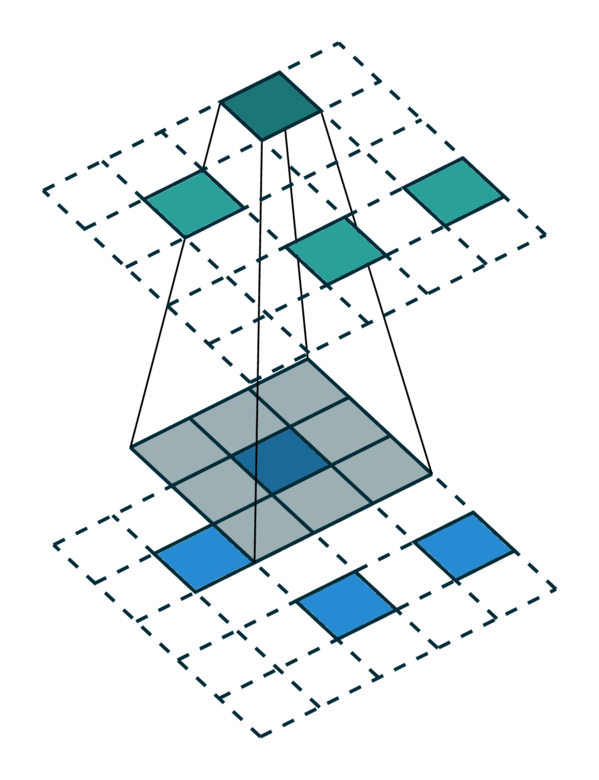
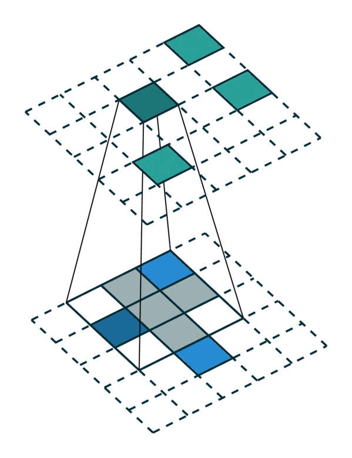

Convolution on a Sparse Tensor
==============================

Sparse Tensor
-------------

In traditional speech, text, or image data, features are extracted densely.
Thus, the most common representations of these data are vectors, matrices, and
tensors. However, for 3-dimensional scans or even higher-dimensional spaces,
such dense representations are inefficient due to the sparsity. Instead, we can
only save the non-empty part of the space as its coordinates and the associated
features. This representation is an N-dimensional extension of a sparse matrix;
thus it is known as a sparse tensor.

In Minkowski Engine, we adopt the same sparse tensor for the basic data
representation and the class is provided as
:attr:`MinkowskiEngine.SparseTensor`. Fore more information on sparse tensors
please refer to the `terminology page <terminology.html>`_.

Generalized Convolution on a Sparse Tensor
------------------------------------------

The convolution is a fundamental operation in many fields. In image perception,
the 2D convolution has achieved state-of-the-art performance in many tasks and
is proven to be the most crucial operation in AI, and computer vision research.
In this work, we adopt the sparse convolution `[2]
<https://arxiv.org/abs/1711.10275>`_ and propose the generalized convolution on a sparse
tensor. The generalized convolution incorporates all discrete convolutions as special cases.
We use the generalized convolution not only on the 3D
spatial axes, but on any arbitrary dimensions, or also on the temporal axis, which is proven to be more
effective than recurrent neural networks (RNN) in some applications.

Specifically, we the generalize convolution for generic input and
output coordinates, and for arbitrary kernel shapes. The generalized convolution
encompasses not only all sparse convolutions but also the
conventional dense convolutions. Let :math:`x^{\text{in}}_\mathbf{u} \in
\mathbb{R}^{N^\text{in}}` be an :math:`N^\text{in}`-dimensional input feature
vector in a :math:`D`-dimensional space at :math:`\mathbf{u} \in \mathbb{R}^D`
(a D-dimensional coordinate), and convolution kernel weights be
:math:`\mathbf{W} \in \mathbb{R}^{K^D \times N^\text{out} \times N^\text{in}}`.
We break down the weights into spatial weights with :math:`K^D` matrices of
size :math:`N^\text{out} \times N^\text{in}` as :math:`W_\mathbf{i}` for
:math:`|\{\mathbf{i}\}_\mathbf{i}| = K^D`. Then, the conventional dense
convolution in D-dimension is

.. math::
   \mathbf{x}^{\text{out}}_\mathbf{u} = \sum_{\mathbf{i} \in \mathcal{V}^D(K)} W_\mathbf{i} \mathbf{x}^{\text{in}}_{\mathbf{u} + \mathbf{i}} \text{ for } \mathbf{u} \in \mathbb{Z}^D,

where :math:`\mathcal{V}^D(K)` is the list of offsets in :math:`D`-dimensional
hypercube centered at the origin. e.g. :math:`\mathcal{V}^1(3)=\{-1, 0, 1\}`.
The generalized convolution in the following equation relaxes the above
equation.

.. math::
   \mathbf{x}^{\text{out}}_\mathbf{u} = \sum_{\mathbf{i} \in \mathcal{N}^D(\mathbf{u}, \mathcal{C}^{\text{in}})} W_\mathbf{i} \mathbf{x}^{\text{in}}_{\mathbf{u} + \mathbf{i}} \text{ for } \mathbf{u} \in \mathcal{C}^{\text{out}}

where :math:`\mathcal{N}^D` is a set of offsets that define the shape of a
kernel and :math:`\mathcal{N}^D(\mathbf{u}, \mathcal{C}^\text{in})=
\{\mathbf{i} | \mathbf{u} + \mathbf{i} \in \mathcal{C}^\text{in}, \mathbf{i}
\in \mathcal{N}^D \}` as the set of offsets from the current center,
:math:`\mathbf{u}`, that exist in :math:`\mathcal{C}^\text{in}`.
:math:`\mathcal{C}^\text{in}` and :math:`\mathcal{C}^\text{out}` are predefined
input and output coordinates of sparse tensors. First, note that the input
coordinates and output coordinates are not necessarily the same.  Second, we
define the shape of the convolution kernel arbitrarily with
:math:`\mathcal{N}^D`. This generalization encompasses many special cases such
as the dilated convolution and typical hypercubic kernels. Another interesting
special case is the sparse submanifold convolution when we set
:math:`\mathcal{C}^\text{out} = \mathcal{C}^\text{in}` and :math:`\mathcal{N}^D
= \mathcal{V}^D(K)`. If we set :math:`\mathcal{C}^\text{in} =
\mathcal{C}^\text{out} = \mathbb{Z}^D` and :math:`\mathcal{N}^D =
\mathcal{V}^D(K)`, the generalized convolution on a sparse tensor becomes the conventional
dense convolution.  If we define the :math:`\mathcal{C}^\text{in}` and
:math:`\mathcal{C}^\text{out}` as multiples of a natural number and
:math:`\mathcal{N}^D = \mathcal{V}^D(K)`, we have a strided dense convolution.

.. |dense| image:: images/conv_dense.gif
   :width: 100%

.. |sparse| image:: images/conv_sparse.gif
   :width: 100%

We visualize a simple 2D image convolution on a dense tensor and a sparse tensor. Note that the order of convolution on a sparse tensor is not sequential.

+--------------------------+----------------------------+
| Dense Tensor             | Sparse Tensor              |
+==========================+============================+
| |dense|                  | |sparse|                   |
+--------------------------+----------------------------+
| [Photo Credit: `Chris Choy <https://chrischoy.org>`_] |
+-------------------------------------------------------+

To efficiently compute the convolution on a sparse tensor, we must find how each non-zero element in an input sparse tensor is mapped to the output sparse tensor. We call this mapping a kernel map `[3] <https://arxiv.org/abs/1904.08755>`_ since it defines how an input is mapped to an output through a kernel. Please refer to the `terminology page <terminology.html>`_ for more details.

Special Cases of Generalized Convolution
----------------------------------------

The generalized convolution encompasses all discrete convolution as its special cases. We will go over a few special cases in this section.
First, when the input and output coordinates are all elements on a grid. i.e. a dense tensor, the generalized convolution is equivalent to regular convolution on a dense tensor.
Second, when the input and output coordinates are the coordinates of non-zero elements on a sparse tensor, the generalized convolution becomes the sparse convolution `[2] <https://arxiv.org/abs/1711.10275>`_.
Also, when we use a hyper-cross shaped kernel `[3] <https://arxiv.org/abs/1904.08755>`_, the generalized convolution is equivalent to the separable convolution.

+------------------------------+------------------------------+------------------------------+
| Same in/out coordinates      | Arbitrary in/out coordinates | Generalized Convolution      |
+==============================+==============================+==============================+
| |sparse_conv|                | |sparse|                     | |generalized|                |
+------------------------------+------------------------------+------------------------------+
| [Photo Credit: `Chris Choy <https://chrischoy.org>`_]                                      |
+--------------------------------------------------------------------------------------------+

References
----------

- `[1] An Investigation of Sparse Tensor Formats for Tensor Libraries, 2015 <http://groups.csail.mit.edu/commit/papers/2016/parker-thesis.pdf>`_
- `[2] 3D Semantic Segmentation with Submanifold Sparse Convolutional Neural Networks, CVPR'18 <https://arxiv.org/abs/1711.10275>`_
- `[3] 4D Spatio-Temporal ConvNets: Minkowski Convolutional Neural Networks, CVPR'19 <https://arxiv.org/abs/1904.08755>`_
