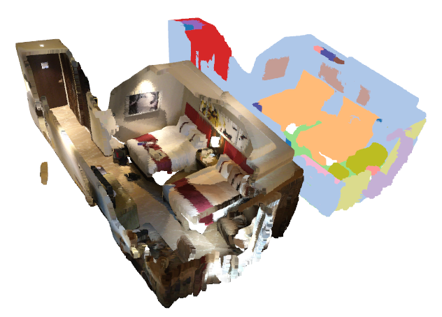

Semantic Segmentation
=====================

To run the example, please install `Open3D <http://www.open3d.org/>`_ with `pip
install open3d-python`.

.. code-block:: shell

   cd /path/to/MinkowskiEngine
   python -m examples.indoor

Segmentation of a hotel room
----------------------------

When you run the example, you will see a hotel room and semantic segmentation
of the room. You can interactively rotate the visualization when you run the
example.

First, we load the data and voxelize (quantize) the data. The voxelization is
done by calling :attr:`MinkowskiEngine.utils.sparse_quantize`.

.. code-block:: python

    pcd = o3d.read_point_cloud(file_name)
    coords = np.array(pcd.points)
    feats = np.array(pcd.colors)

    quantized_coords = np.floor(coords / voxel_size)
    inds = ME.utils.sparse_quantize(quantized_coords)

Once you prepare a voxelized coordinates and features, we should wrap it with
the :attr:`MinkowskiEngine.SparseTensor`. Before we do that, we should create a
batch by calling :attr:`MinkowskiEngine.utils.sparse_collate`. This function
takes a set of coordinates and features and concatenate the set. Also it append
the batch index to the coordinates. Finally, we pseudo-normalize the features
by subtracting 0.5 from the colors.

.. code-block:: python

   # Create a batch, this process is done in a data loader during training in parallel.
   batch = [load_file(config.file_name, 0.02)]
   coordinates_, featrues_, pcds = list(zip(*batch))
   coordinates, features = ME.utils.sparse_collate(coordinates_, featrues_)

   # Normalize features and create a sparse tensor
   sinput = ME.SparseTensor(features - 0.5, coords=coordinates).to(device)

Finally, we feed-forward the sparse tensor into the network and get the predictions.

.. code-block:: python

   soutput = model(sinput)
   _, pred = soutput.F.max(1)

After doing some post-processing. We can color the labels and visualize the
input and the prediction side-by-side.

The weights are downloaded automatically once you run the example and the
weights are currently the top-ranking algorithm on the `Scannet 3D segmentation
benchmark <http://kaldir.vc.in.tum.de/scannet_benchmark/>`_.

Please refer to the `complete indoor segmentation example
<https://github.com/StanfordVL/MinkowskiEngine/blob/master/examples/indoor.py>`_
for more detail.
